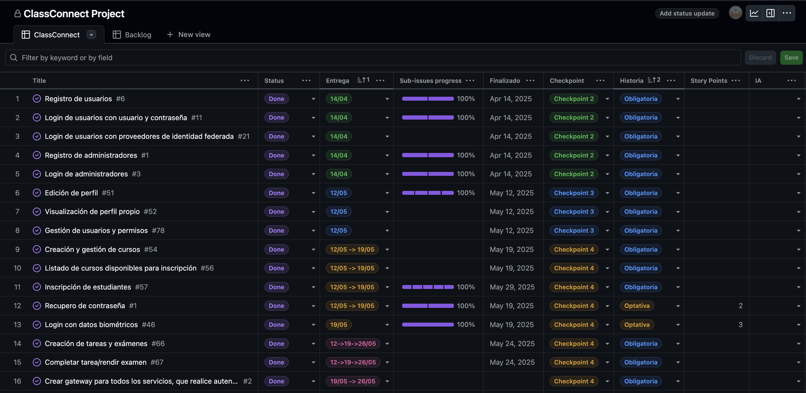
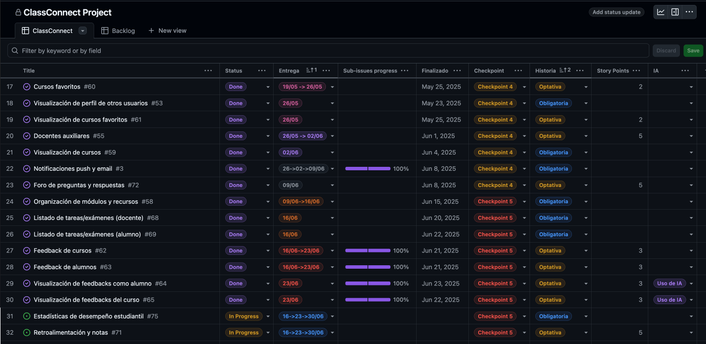
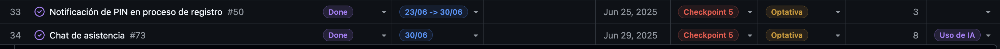

# 📝 Bitácora del Proyecto ClassConnect

## 🚀 Desarrollo del Sistema Educativo

Esta bitácora documenta el proceso de desarrollo de **ClassConnect**, una plataforma educativa integral que conecta estudiantes, docentes y administradores a través de una aplicación móvil y un sistema de backoffice.

---

## 📊 GitHub Project - Gestión de Issues

El proyecto utiliza GitHub Project para gestionar las tareas y seguimiento del desarrollo. Las siguientes imágenes muestran la configuración completa del tablero de gestión:

🔗 **[Ver GitHub Project completo](https://github.com/orgs/TP-ClassConnect-G6/projects/1/views/1)**

### Vista Completa del GitHub Project

### 🔧 Estructura de Campos del Project

**📋 Campos Principales:**
- **Título de Issue**: Descripción de la tarea o historia de usuario
- **Status**: Estado actual del issue
  - 🔄 **Backlog**: Tareas pendientes por iniciar
  - ⚡ **In Progress**: Tareas en desarrollo
  - 🔙 **Back Done**: Tareas completadas del lado del backend pero requieren front
  - ✅ **Done**: Tareas finalizadas

**📅 Campos de Tiempo:**
- **Fecha de Entrega**: Deadline para entregar el issue
- **Fecha de Finalizado**: Cuándo se completó realmente la tarea

**📈 Campos de Seguimiento:**
- **Subissues Progress**: Progreso de las subtareas relacionadas
- **Checkpoint**: Identificación de los 5 checkpoints de entrega del proyecto

**📚 Campos de Historia:**
- **Historia**: Clasificación como historia obligatoria u optativa
- **Story Points**: Puntos asignados a las historias optativas para estimación
- **IA**: Marcador para identificar si la historia requiere incorporación de inteligencia artificial

---

